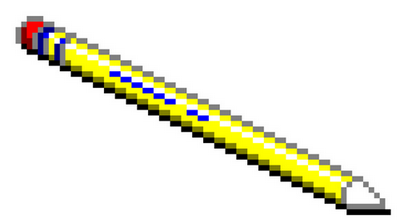
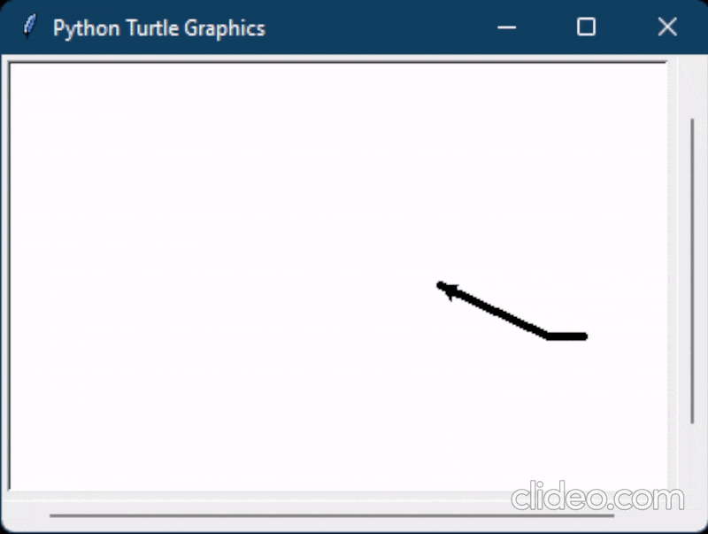

# BMK01_Turtle_Pencil

## Современное кроссплатформенное программирование

### Практическая работа №6. Работа с графикой Python

Программа, которая создает на форме рисунок карандаша. Рисунок необходимо создавать с помощью модуля «turtle».

### Вариант №1 - Карандаш

## Карандаш с использованием Turtle

